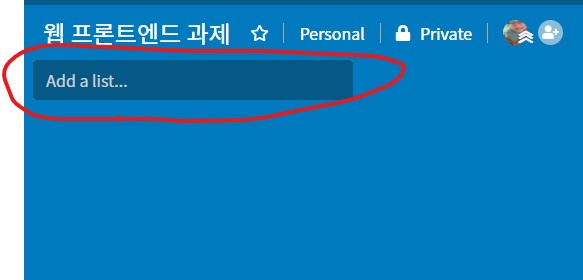
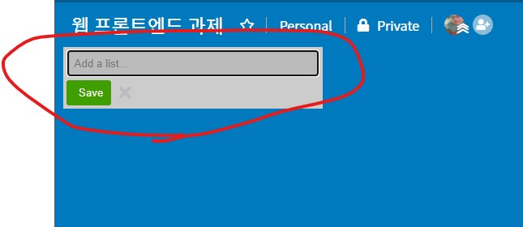
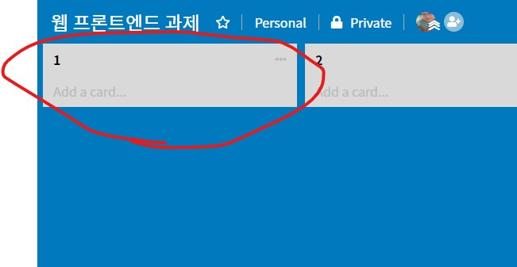
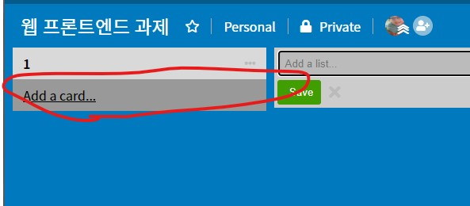
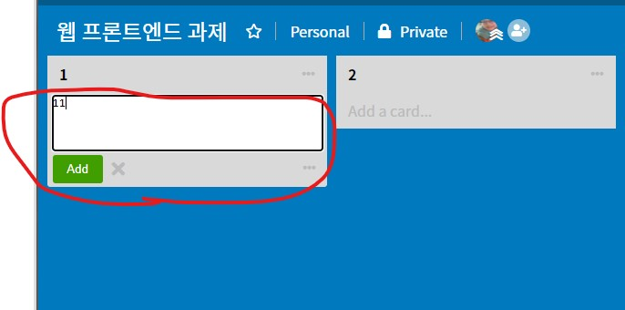
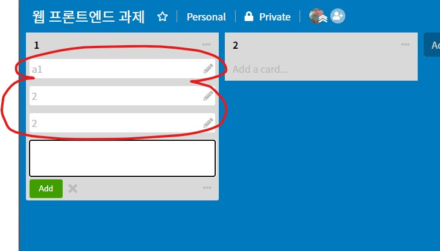

# Trello Clone
---

## installation

```bash
npm i

# dist error 시에..
cd ./src/client-app
tsc
cd ./src/server
tsc

# 클라이언트 실행
npm start

# 서버 실행
npm serve
```

---

> ListsView
> -> AddListView -> AddingListView -> AddedListView
> -> AddCardView -> AddingCardView -> AddedCardView
> 순으로 리스트 / 카드가 쌓여나감.

> TemplateHelper 에서 template 을 가져와서 element attach.

---

// <br />
// AddListView

---

// <br />
// AddingListView

---

// <br />
// AddedListView

---

// <br />
// AddCardView

---

// <br />
// AddingCardView

---

// <br />
// AddedCardView

---

> Controller 에서 각 View 별 interaction 을 처리.

> ViewCache 에서 View 를(들을) 가지고 있음.

> Model 에서 web server 와 통신.

> Service 에서 REST API Method 사용.

[add-list]: ./img/desc/add-list.jpg "add list alt"
